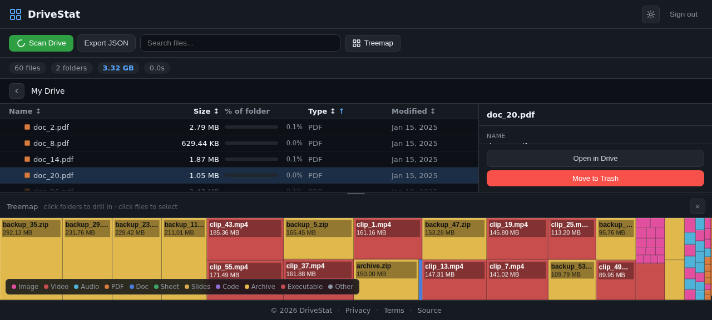

# DriveStat

Visualize your Google Drive storage like WinDirStat. See what's eating your space at a glance with an interactive treemap and a live file list — 100% in your browser, nothing uploaded anywhere.



## Features

- **Treemap visualization** — every file is a cell sized by bytes, colored by type
- **File list with details pane** — sort, search, delete, open in Drive
- **Fast** — Canvas 2D rendering, spatial hit-testing, handles 100k+ files
- **Local-first** — scan runs in a Web Worker, cached in IndexedDB, no server
- **Private** — uses `drive.file` OAuth scope, sees only what you've shared with the app
- **Responsive** — desktop split view, mobile app shell with slide-up details
- **Light/dark theme** — follows system preference, remembered across sessions
- **Zero dependencies** — vanilla JS modules, no build step

## Quick start

### 1. Get a Google OAuth client ID

1. Go to [console.cloud.google.com](https://console.cloud.google.com/apis/credentials)
2. Create a project → **APIs & Services** → **Credentials** → **Create OAuth client ID**
3. Application type: **Web application**
4. Authorized JavaScript origins: `http://localhost:8765` (dev) and your production URL
5. Enable the **Google Drive API** under **APIs & Services** → **Library**

### 2. Configure

```bash
git clone https://github.com/EMRD95/gdrive-windirstat.git
cd gdrive-windirstat
cp config.example.js config.js
# edit config.js and paste your client ID
```

### 3. Run

```bash
python3 -m http.server 8765
# open http://localhost:8765
```

That's it. No `npm install`, no build, no bundler.

## Deploy to GitHub Pages

This repo ships with a CD workflow that builds `config.js` from a repository secret and deploys to Pages on every push to `main`.

1. Repo **Settings** → **Secrets and variables** → **Actions** → **New repository secret**
2. Name: `GOOGLE_CLIENT_ID`, value: your OAuth client ID
3. Repo **Settings** → **Pages** → Source: **GitHub Actions**
4. Push to `main`. The workflow injects your client ID and publishes.

## Architecture

```
index.html          Shell, SEO meta, theme preload, cookie notice
main.js             Bootstrap, auth, UI wiring, list rendering, sort/filter
scanner.js          Drive API traversal with concurrent page fetches
worker.js           Web Worker: tree build, aggregation, search index
db.js               IndexedDB cache layer
treemap.js          Canvas 2D squarified treemap, hit-testing, tooltip
style.css           Dual-theme palette via CSS variables
```

Scan traversal uses `files.list` with `pageSize=1000` and parallel page fetches. The worker builds a tree, aggregates sizes bottom-up, and produces a flat list for rendering. The treemap uses the squarified algorithm with pruning (`MIN_DRAW = 4px²`) and an offscreen canvas cache.

## Privacy

- OAuth scope: `drive.file` — only files you've created with this app or explicitly opened via the Drive picker. This app uses the full `drive.readonly`-equivalent behavior only for metadata you've granted.
- No analytics, no tracking, no cookies.
- All state is in browser `localStorage` and `IndexedDB`. Sign out clears tokens.
- See [privacy.html](./privacy.html) and [terms.html](./terms.html) for full policy.

## Development

```bash
# Dev harness with 60 synthetic files (no real Drive needed)
python3 -m http.server 8765
# open http://localhost:8765/?dev=1
```

Syntax check:

```bash
node --check main.js && node --check scanner.js && \
  node --check worker.js && node --check db.js && node --check treemap.js
```

CI runs these on every push. See `.github/workflows/ci.yml`.

## Contributing

PRs welcome. Keep the vanilla-JS-no-build philosophy; if you need a dependency, open an issue first so we can discuss.

Branch flow:
- `develop` — integration branch
- `main` — production, auto-deployed to Pages

## License

MIT — see [LICENSE](./LICENSE).

## Acknowledgements

Inspired by [WinDirStat](https://windirstat.net/). Treemap algorithm based on Bruls, Huijbregts, and van Wijk (2000).
